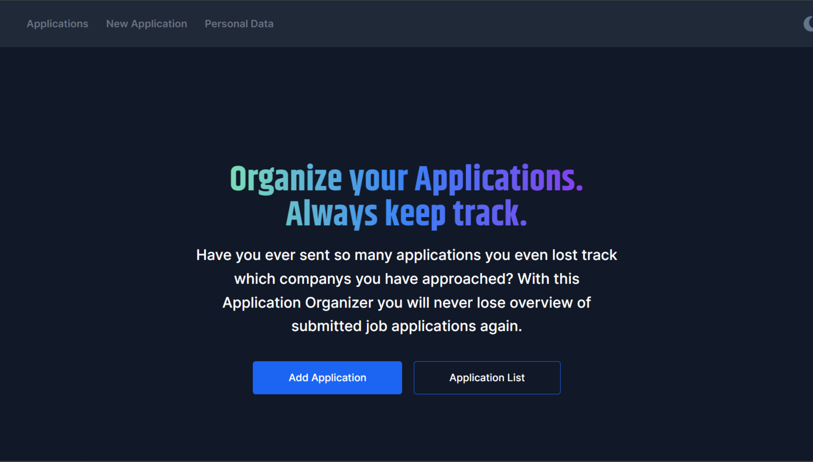
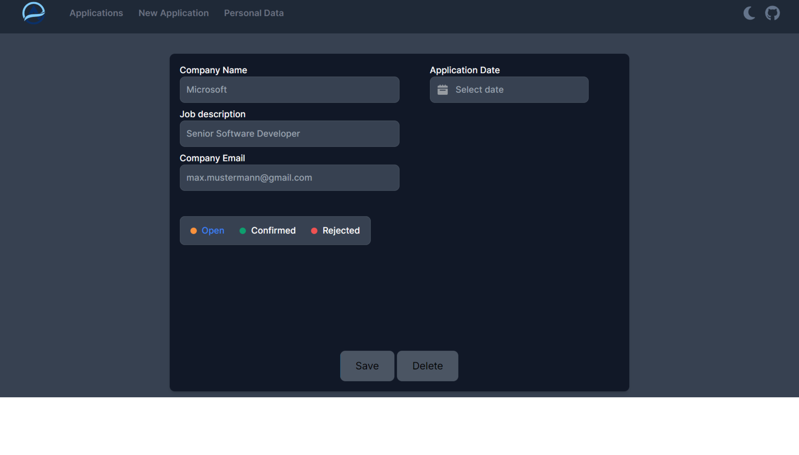
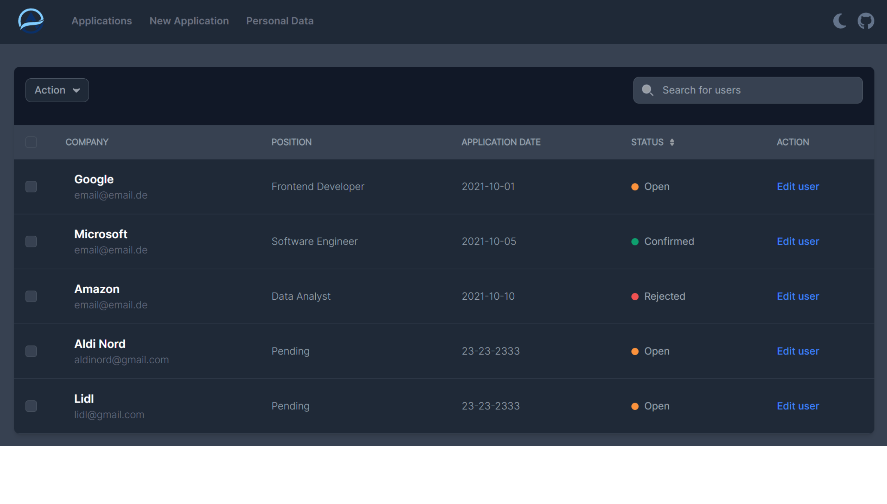

# Application Organizer

This is an application organizer to keep track of your applications. 
...still in progress

## Requirements

1. Node.js
2. Express
3. Tailwind CSS
4. SQLite

## Installation

1. Download project or clone by using:

```bash
git clone https://github.com/Ibraboss13/application-app.git
```
2. Start with IDE or Code Editor.
3. Open terminal and type:
```bash
npm start
```
4. Open 
`http://localhost:5500/`

## Screenshots




